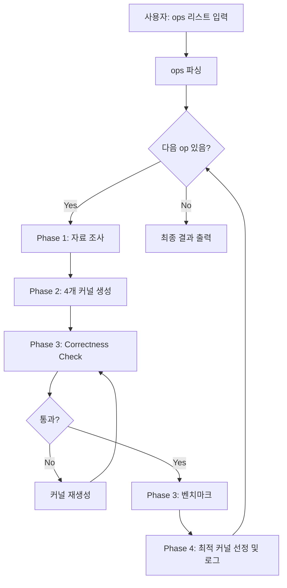
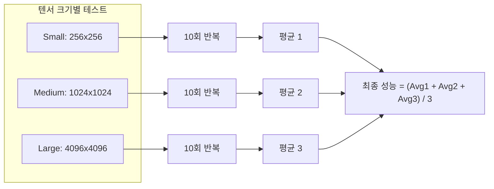

# Torch-to-Triton Kernel Agent Skills 구현 계획

## 개요

사용자가 여러 torch operations를 입력하면, agent가 각 연산에 대해 4단계 파이프라인을 순차적으로 실행하여 최적화된 Triton kernel을 생성합니다.

## 핵심 요구사항

| 요구사항 | 설명 |

|----------|------|

| **다중 Ops 처리** | 사용자가 여러 ops를 한번에 입력 가능, 각 op은 Phase 1-4를 모두 거침 |

| **벤치마크 방식** | Small/Medium/Large 텐서 각 10회 실행, 3가지 평균의 최종 평균 |

| **재생성 로직** | Correctness check 실패 시 해당 커널을 통과할 때까지 재생성 |

## 추천 최적화 기법 (2개)

| 기법 | 설명 | 효과 |

|------|------|------|

| **Tiling** | 데이터를 BLOCK_SIZE 단위 타일로 분할 | 캐시 효율성 극대화 |

| **Memory Coalescing** | 연속 메모리 접근 패턴 최적화 | 메모리 대역폭 활용률 극대화 |

## Agent 워크플로우



## 벤치마크 프로토콜



## 프로젝트 파일 구조

```
/root/cursor-skills-test/
├── skills.md                 # Agent 워크플로우 정의
├── kernels/
│   └── {op_name}/            # 각 op별 디렉토리
│       ├── v1_baseline.py
│       ├── v2_tiling.py
│       ├── v3_coalesced.py
│       └── v4_optimized.py
├── tests/
│   ├── test_correctness.py   # 정확도 검증 (atol=1e-5, rtol=1e-5)
│   └── test_benchmark.py     # 3가지 크기 x 10회 벤치마크
├── logs/
│   └── {op_name}_log.md      # 각 op별 프로세스 로그
└── requirements.txt
```

## Skills.md 주요 섹션

### Phase 1: 자료 조사 및 분석

- torch op의 공식 문서 및 소스 코드 분석
- 입력/출력 텐서 shape, dtype, 메모리 레이아웃 파악
- 연산의 수학적 정의 및 계산 복잡도 정리

### Phase 2: 4가지 Triton Kernel 작성

- `v1_baseline`: 직접적인 1:1 변환 (최적화 없음)
- `v2_tiling`: BLOCK_SIZE 파라미터로 타일링 적용
- `v3_coalesced`: 메모리 접근 패턴 최적화
- `v4_optimized`: Tiling + Coalescing 조합

### Phase 3: Correctness Check + 재생성 로직

```
for each kernel in [v1, v2, v3, v4]:
    while True:
        result = run_correctness_test(kernel)
        if result.passed:
            break
        else:
            kernel = regenerate_kernel(kernel, error=result.error)
            # 최대 3회 재시도 후 실패 보고
```

### Phase 3: 벤치마크 실행

```python
TENSOR_SIZES = {
    "small": (256, 256),
    "medium": (1024, 1024),
    "large": (4096, 4096)
}
NUM_RUNS = 10

for kernel in [v1, v2, v3, v4]:
    times = []
    for size_name, size in TENSOR_SIZES.items():
        size_times = [benchmark(kernel, size) for _ in range(NUM_RUNS)]
        times.append(mean(size_times))
    final_perf = mean(times)  # 3가지 크기 평균의 평균
```

### Phase 4: 결과 정리 및 로그 작성

- 4개 커널 벤치마크 결과 비교 테이블
- 가장 빠른 커널 선택 및 torch 대비 speedup 계산
- `logs/{op_name}_log.md`에 전체 과정 기록

## 다중 Ops 처리 예시

사용자 입력: `softmax, layernorm, gelu`

Agent 실행 순서:

1. softmax → Phase 1 → Phase 2 → Phase 3 → Phase 4 → 완료
2. layernorm → Phase 1 → Phase 2 → Phase 3 → Phase 4 → 완료
3. gelu → Phase 1 → Phase 2 → Phase 3 → Phase 4 → 완료
4. 최종 요약 리포트 출력